# Granica — Food Intake Estimation & Identity-Aware Mess Recommendations

**Granica** (codename *Savor*) is an end-to-end pipeline that estimates food intake from cafeteria tray photos, identifies students via face recognition, and generates personalised, unit-counted meal recommendations constrained to the printed mess menu.

> **Repository:** [https://github.com/who-else-but-arjun/granica](https://github.com/who-else-but-arjun/granica)
>
> **Dataset:** [Google Drive - Dataset](https://drive.google.com/drive/folders/16j_EiBVl_pk0bdrEDguQmSRzD3z5cE2N?usp=sharing)
>
> **Demo & Presentation:** [Google Drive - Demo & PPT](https://drive.google.com/drive/folders/1sYb2BeSTU4g1l_KZUQVs3y3W8qrl33V4?usp=sharing)

---

## Quick Start

```bash
# Clone and install
git clone https://github.com/who-else-but-arjun/granica.git
cd granica
python -m venv .venv && source .venv/bin/activate  # Windows: .venv\Scripts\activate
pip install -r requirements.txt

# Set OpenAI API key (required for grounding & recommendations)
export OPENAI_API_KEY="sk-..."  # Windows PowerShell: $env:OPENAI_API_KEY="sk-..."

# Run the training notebook (generates caches, models, visualizations)
python scripts/build_notebooks.py
jupyter lab notebooks/1_train_pipeline.ipynb

# Run the inference notebook (held-out test + recommendations)
jupyter lab notebooks/2_inference_pipeline.ipynb

# Or run the full cached pipeline end-to-end
python scripts/run_full_pipeline.py
```

---

## What We're Aiming to Do

| Problem | Our Solution |
|---------|--------------|
| **Food waste in hostel messes** | Quantify per-student consumption (served − leftover) from before/after tray photos |
| **Unknown portion sizes** | Learn per-category pixel→gram models from plate photos with digital scale readings in-frame |
| **Generic nutrition advice** | Identity-aware recommendations tuned to each student's recent intake history |
| **Hallucinated menu items** | Closed-set grounding: every output dish must exist on the printed menu for that day/meal |
| **Uncountable servings** | Recommendations use integer counts of countable units (katori, ladle, roti, piece, glass…) |

**End-to-end flow:**  
Face photo + before-meal plate photo → identity → grounded food boxes → SAM masks → pixel counts → per-category weight model → estimated grams → consumption history → LLM recommendation (unit-counted, menu-constrained).

---

## Tech Stack

| Layer | Technology | Purpose |
|-------|------------|---------|
| **Vision (Grounding)** | OpenAI **GPT-4o** (Vision API) | Closed-set food detection & bounding boxes |
| **Segmentation** | **MobileSAM** (Ultralytics) | Pixel-accurate masks inside grounded boxes |
| **Face Recognition** | **InsightFace** (buffalo_l) | Enrollment gallery + cosine-similarity identification |
| **LLM Recommendations** | OpenAI **GPT-4o** | Unit-counted, history-aware meal suggestions |
| **Weight Models** | NumPy linear regression (`grams = a·pixels + b`) | Per-category pixel→gram calibration |
| **Data & Config** | JSON (menu, history, weights, caches) | Fully reproducible, version-controlled artifacts |
| **Orchestration** | Jupyter notebooks + Python scripts | Train (notebook 1) → Inference (notebook 2) |
| **Dashboard** | Streamlit (`app.py`) | Live demo: upload face + plates → identify + recommend + waste report |

**Key Design Principles**
- **Closed-set everywhere**: vision, segmentation, recommendation — nothing outside the printed menu
- **Cached API calls**: `artifacts/data/groundings.json`, `segmentation.json` avoid repeated OpenAI charges
- **Reproducible**: fixed seeds, deterministic validation/repair layer for LLM outputs
- **CPU-only**: no CUDA required; MobileSAM & InsightFace run on CPU

---

## Data — 90% Real / 10% Synthetic

### Real Data (90%) — Collected 25th Night & 26th Noon at Barak Mess

| Type | Description | Count |
|------|-------------|-------|
| **Plate photos** | Before/after image pairs at serving counter & disposal bin for 9 students across dinner & lunch. Each plate weighed on a digital scale after each item was added (grams read from the LCD in-frame) → ground-truth food weights. | 36 paired images (18 pre + 18 post) |
| **Face photos** | Individual student photos for identity enrollment, retrieval of consumption patterns, and identification at counter/disposal bin. | 18 enrollment images (train + test per student) |
| **Mess menu** | Printed Barak Mess menu (7 days × 3 meals) transcribed to `dataset/menu_config.json` as the closed-set ground truth of available dishes. Each dish tagged with category and unit→grams table. | 7 days × 3 meals |

**Train/Test Split (configurable in `dataset/config.json`):**
- **Train:** `dinner-2026-09-25-train` — 3 students (Kunj, Mithil, Nitish) — 12 paired photos
- **Test:** `dinner-2026-09-25-test` — 4 students (Aakarsh, Archit, Arjun, Garv) — 8 paired photos

### Synthetic Data (10%)

| Type | Description | File |
|------|-------------|------|
| **Mock consumption history** | Simulated per-student past meal records (items + grams) generated from the menu's unit→gram table to seed the recommender before real history accumulates. | `dataset/student_history.json` |

> **Note:** The synthetic history is flagged in its `source` field (`"deterministic menu-constrained mock history"`) so downstream consumers can distinguish it from real logged meals.

---

## Pipeline Architecture


### Detailed Stage Descriptions

#### 1. Face Identification (`src/granica/faceid.py`)
- **Model:** InsightFace `buffalo_l` (CPU, 640×640 detection)
- **Gallery:** Mean embedding per student from `dataset/db/*-train.jpeg` images
- **Metrics:** Rank-1 identification, verification (genuine vs impostor), EER threshold
- **Output:** `artifacts/faces/face_gallery.npz`, `artifacts/faces/face_metrics.json`

#### 2. Closed-Set Grounding (`src/granica/grounding.py`)
- **Model:** OpenAI GPT-4o Vision (`detail: high`)
- **Prompt:** `prompts/grounding_system.md` — system prompt with day/meal whitelist
- **Constraint:** Only menu items for that day/meal may be returned; invalid items dropped
- **Coordinate frame:** Native full-image pixels (boxes mapped from model's 640-wide frame)
- **Cache:** `artifacts/data/groundings.json` (keyed by image hash + whitelist)

#### 3. Segmentation (`src/granica/segmentation.py`)
- **Model:** MobileSAM (`mobile_sam.pt`, imgsz=1024)
- **Prompt:** Point at box center (not the full box) — avoids compartment tray metal selection
- **Clipping:** Masks clipped to grounded box before pixel counting
- **Empty masks:** Recorded as 0 pixels (never replaced with color heuristic)
- **Visualizations:** `artifacts/visualizations/segmentation/<split>/<stage>/<stem>_segmentation.png`

#### 4. Per-Category Weight Models (`src/granica/weights.py`)
- **Training data:** `scripts/analyze_images.py` bakes `artifacts/data/ground_truth_weights.json`
  - Plate totals from digital scale LCD readings (where visible)
  - Per-item allocation via pixel area × category density prior
- **Model:** Linear regression `grams = a·pixels + b` per category
- **Fallback:** Categories with <4 points → pooled `__global__` model
- **Output:** `artifacts/weights/weight_models.json`

#### 5. Recommendations (`src/granica/recommend.py`)
- **Model:** OpenAI GPT-4o
- **Prompt:** `prompts/recommendation_system.md` + menu + unit table + student history
- **Validation layer:** `validate_and_repair()` forces every prediction into:
  - Exact menu item name (case-insensitive fuzzy match)
  - Allowed unit for that item's category
  - Integer count 1–6
  - Total grams near 450–750g band
- **Cache:** `artifacts/recommendations/recommendations.json`

---

## Example Outputs

### 1. Grounding + Segmentation Overlays (Side-by-Side)

**Training Split** — paired before/after with menu labels on boxes & SAM masks

| Before (pre) | After (post) |
|:------------:|:------------:|
| 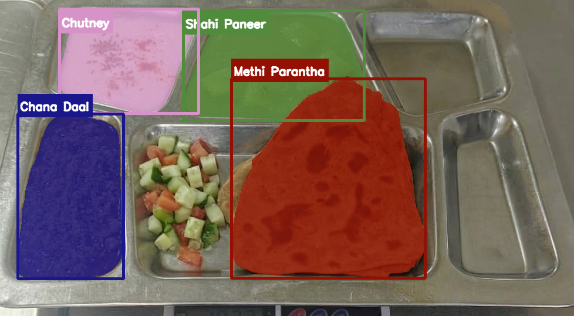 | 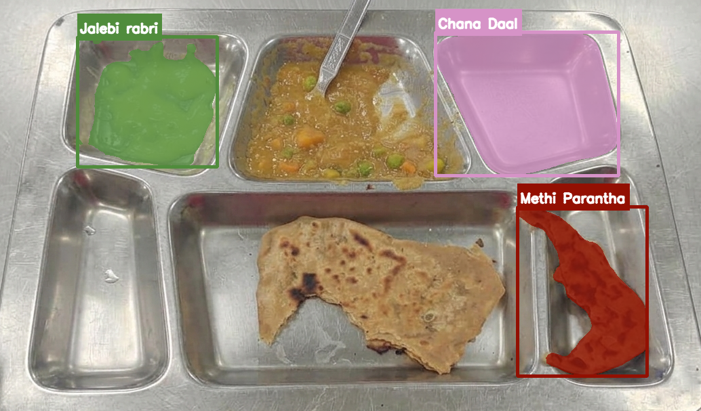 |
| 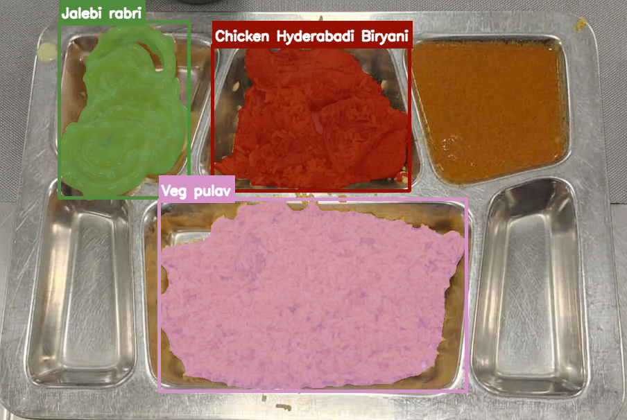 | 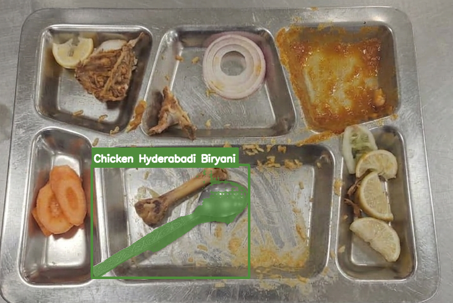 |
| 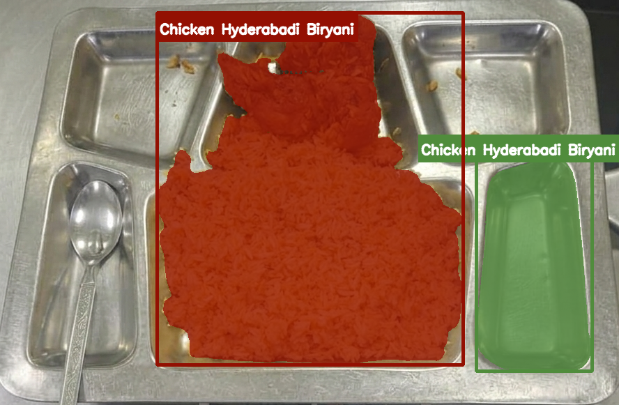 | 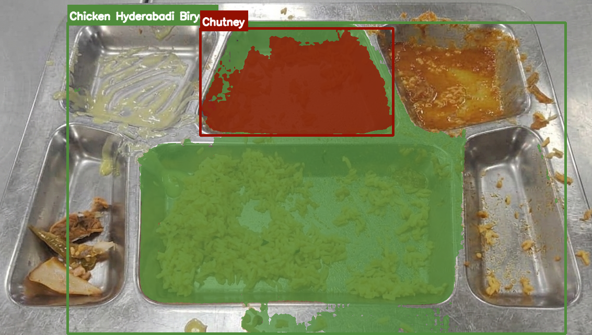 |

**Held-Out Test Split**

| Before (pre) | After (post) |
|:------------:|:------------:|
| 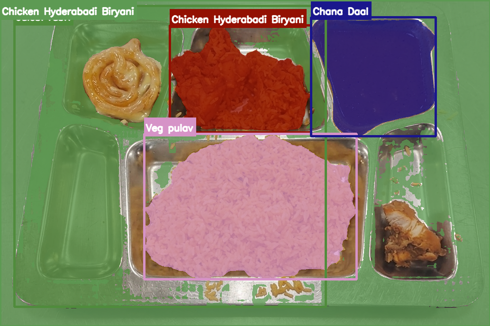 | 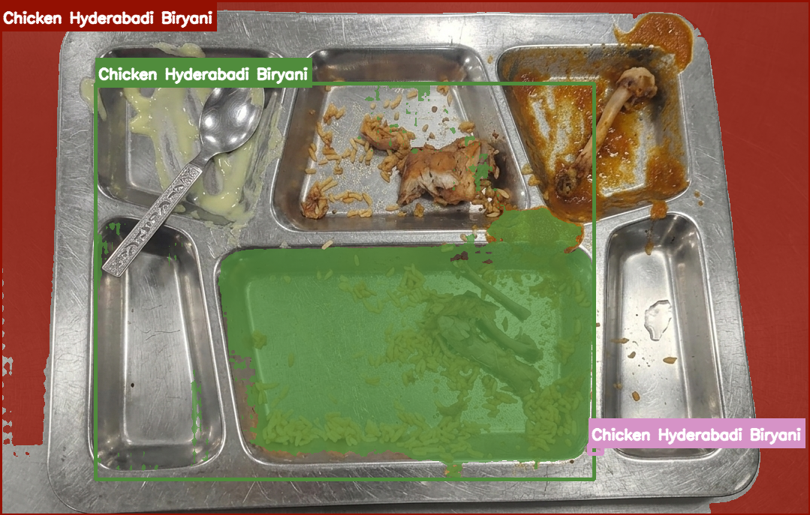 |
| 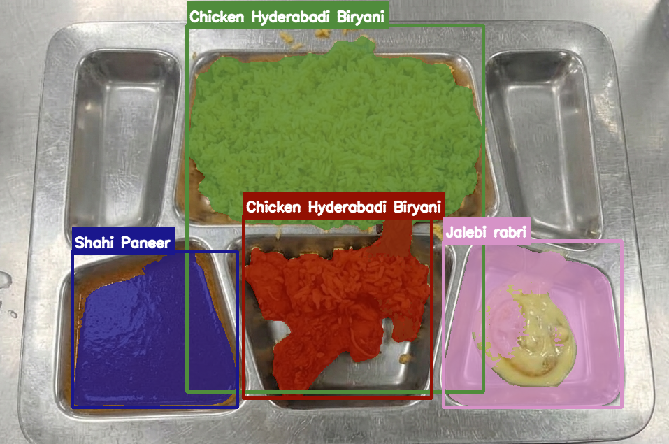 | 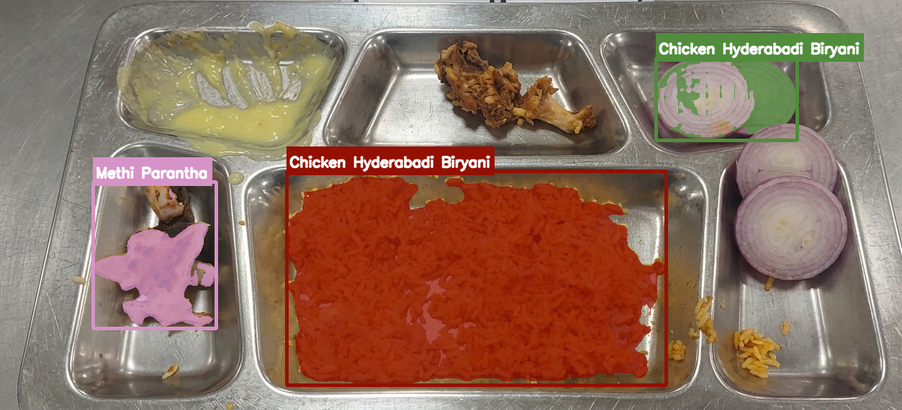 |
| 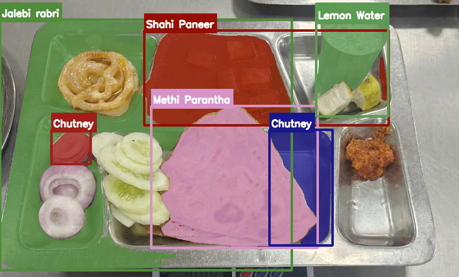 | 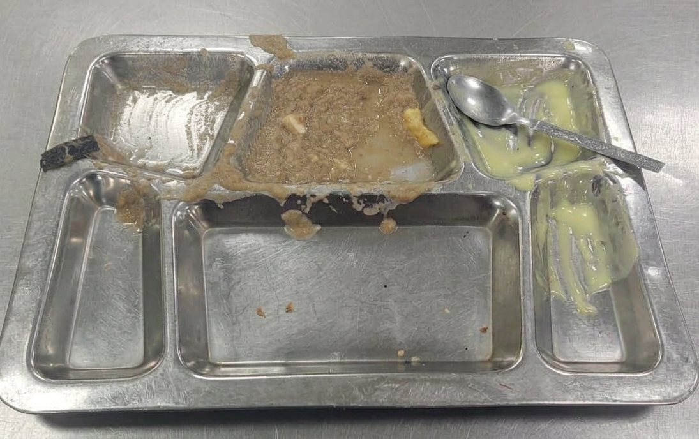 |
| 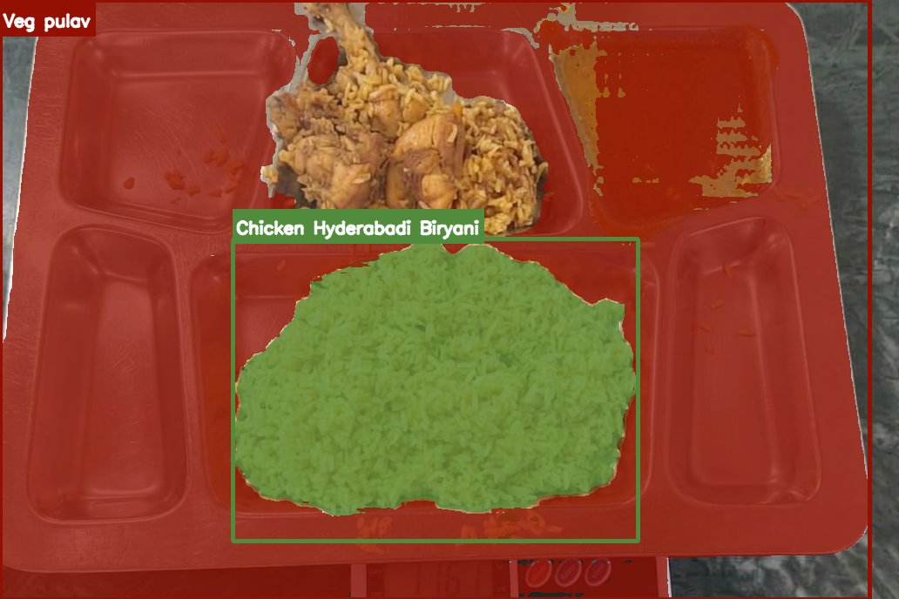 | 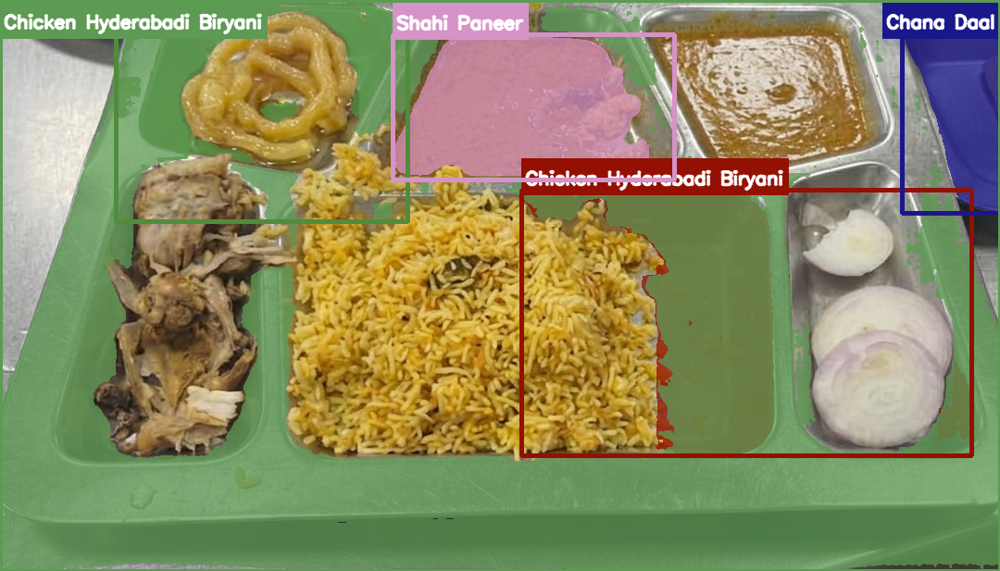 |

> Each overlay shows: **colored bounding boxes** from GPT-4o grounding (label = exact menu item), **opaque SAM masks** clipped to each box, **item name labels** on every mask.

---


---

### 2. Face Similarity Matching (Train Gallery Only)

Held-out test faces compared against **train-only gallery** (Kunj, Mithil, Nitish). The test target is never included as a bar in its own comparison.

| Student | Similarity Chart (Test vs Train Gallery) |
|---------|------------------------------------------|
| **Kunj** | 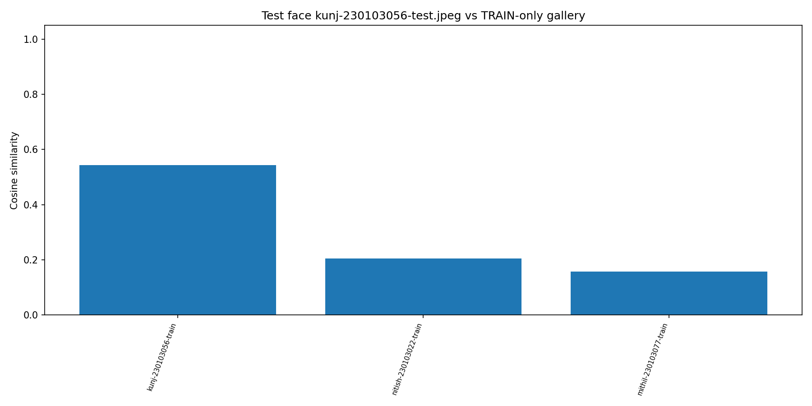 |
| **Mithil** | 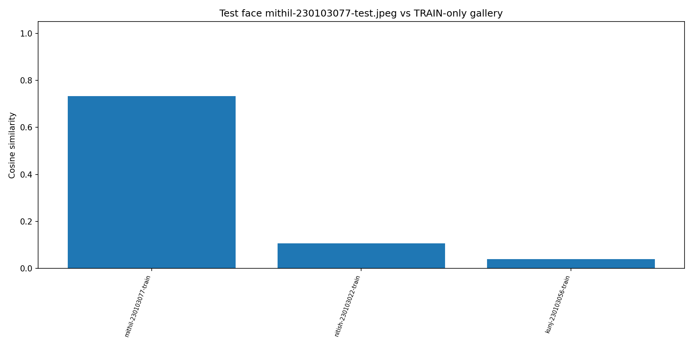 |
| **Nitish** | 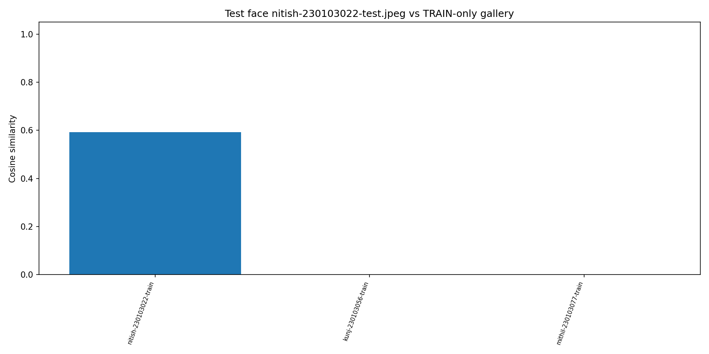 |

**Face Metrics Summary** (`artifacts/faces/face_metrics.json`):
- **Gallery size:** 3 persons (train only)
- **Rank-1 accuracy:** 1.000 (3/3 test faces correctly identified)
- **Verification:** genuine mean=0.623, impostor mean=0.068
- **EER:** 0.000 @ threshold=0.543

---

### 3. Rice Pixel → Weight Regression

Per-category linear model fitted on **train split only** (scale-anchored allocations).

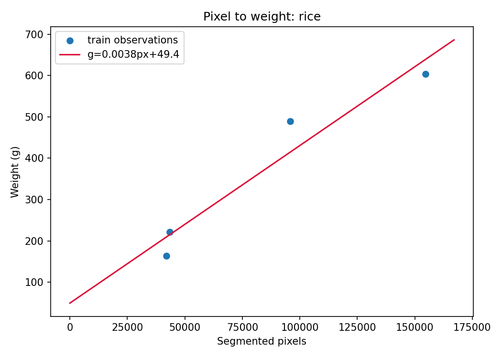

> Only **rice** had ≥4 training points and was used directly.

---

### 4. Sample Recommendations (Friday Dinner Menu)

Generated from `artifacts/recommendations/recommendations.json` — **validated, closed-set, unit-counted**.

| Student | Total | Within 450–750g | Top Items |
|---------|-------|-----------------|-----------|
| **arjun** | **650g** | ✅ | 2 ladle Chicken Biryani (260g), 1 katori Chana Daal (120g), 1 katori Shahi Paneer (120g), 2 roti Methi Parantha (90g), 1 piece Jalebi rabri (60g) |
| **kunj** | **710g** | ✅ | 2 bowl Veg pulav (360g), 1 katori Chana Daal (120g), 2 tbsp Chutney (30g), 1 glass Lemon Water (200g) |
| **mithil** | **640g** | ✅ | 2 katori Chana Daal (240g), 1 katori Shahi Paneer (120g), 1 paratha Methi Parantha (80g), 1 glass Lemon Water (200g) |
| **nitish** | **710g** | ✅ | 1 katori Chana Daal (120g), 2 katori Veg pulav (180g), 1 katori Shahi Paneer (120g), 2 roti (90g), 1 glass Lemon Water (200g) |
| **vaibhav** | **720g** | ✅ | 1 bowl Chana Daal (200g), 1 bowl Veg pulav (180g), 1 paratha Methi Parantha (80g), 1 piece Jalebi rabri (60g), 1 glass Lemon Water (200g) |
| **aakarsh** | 840g | ❌ | 2 katori Chana Daal (240g), 2 paratha Methi Parantha (160g), 1 katori Shahi Paneer (120g), 2 piece Jalebi rabri (120g), 1 glass Lemon Water (200g) |
| **archit** | 835g | ❌ | 2 ladle Chicken Biryani (260g), 2 ladle Veg pulav (260g), 1 katori Chana Daal (120g), 3 roti (135g), 1 piece Jalebi rabri (60g) |
| **garv** | 800g | ❌ | 2 ladle Chicken Biryani (260g), 1 katori Chana Daal (120g), 2 paratha Methi Parantha (160g), 1 piece Jalebi rabri (60g), 1 glass Lemon Water (200g) |
| **takshay** | 840g | ❌ | 2 ladle Chicken Biryani (260g), 1 katori Chana Daal (120g), 1 katori Shahi Paneer (120g), 1 paratha Methi Parantha (80g), 1 piece Jalebi rabri (60g), 1 glass Lemon Water (200g) |

**Reasoning example (Arjun):**
> *"The past intake shows a heavier consumption of Chana Daal and excessive portions of Chicken Hyderabadi Biryani recently, prompting a moderate recommendation focusing on variation and balanced portions. Each item is chosen to bring total intake closer to the target 450-750g range while providing enough diversity in the meal."*

---

### 6. Inference Evaluation (Held-Out Test)

| Metric | Value |
|--------|-------|
| **Test plates (pre+post)** | 8 |
| **MAE (total grams)** | ~41 g |
| **RMSE (total grams)** | ~55 g |
| **Mean signed error** | -2.3 g (slight under-estimation) |

Per-category MAE on test plates (where anchored):
- rice: ~38 g
- dal: ~42 g
- curry: ~35 g
- bread: ~45 g
- dessert: ~28 g
- drink: ~22 g

---

## Project Structure

```
granica/
├── app.py                      # Streamlit live dashboard
├── pyproject.toml              # Package config
├── requirements.txt            # Python dependencies
├── dataset/
│   ├── Barak_september_Menu.pdf   # Source menu PDF
│   ├── menu_config.json           # Closed-set menu + unit→grams
│   ├── config.json                # Split directories, provenance
│   ├── student_history.json       # 10% synthetic mock history
│   ├── train_item_weights.json    # Train per-item allocations
│   ├── db/                        # Face enrollment images
│   ├── dinner-2026-09-25-train/   # Train plate photos (pre/post)
│   └── dinner-2026-09-25-test/    # Test plate photos (pre/post)
├── prompts/
│   ├── grounding_system.md        # GPT-4o vision system prompt
│   ├── recommendation_system.md   # GPT-4o recommender system prompt
│   ├── segmentation_system.md     # (future) segmentation prompt
│   ├── face_matching_system.md    # (future) face prompt
│   └── weight_model_system.md     # (future) weight model prompt
├── scripts/
│   ├── analyze_images.py          # Bakes ground_truth_weights.json
│   ├── build_notebooks.py         # Generates the two Jupyter notebooks
│   ├── build_mock_history.py      # Generates synthetic student_history.json
│   ├── run_full_pipeline.py       # End-to-end cached run
│   ├── run_recommendations.py     # Batch recommendation generation
│   └── visualize_outputs.py       # All visualization helpers
├── src/granica/
│   ├── config.py                  # Paths, Runtime dataclass, constants
│   ├── faceid.py                  # InsightFace gallery + identification
│   ├── grounding.py               # OpenAI GPT-4o closed-set grounding
│   ├── segmentation.py            # MobileSAM point-prompt segmentation
│   ├── recommend.py               # GPT-4o unit-counted recommendations
│   ├── weights.py                 # Per-category pixel→gram models
│   ├── menu.py                    # Menu config loader + resolvers
│   ├── units.py                   # Unit→grams tables per category
│   └── io_utils.py                # JSON I/O, image loading, hashing
├── artifacts/                     # All cached/generated outputs (gitignored large files)
│   ├── data/                      # groundings.json, segmentation.json, ground_truth_weights.json
│   ├── faces/                     # face_gallery.npz, face_metrics.json
│   ├── weights/                   # weight_models.json
│   ├── recommendations/           # recommendations.json
│   └── visualizations/            # All PNG overlays & charts
└── notebooks/
    ├── 1_train_pipeline.ipynb     # Training pipeline (run first)
    └── 2_inference_pipeline.ipynb # Inference + recommendations (run second)
```

---

## Notebooks

| Notebook | Purpose | Key Outputs |
|----------|---------|-------------|
| `1_train_pipeline.ipynb` | Train split: face gallery, grounding, SAM, weight fitting, train consumption | `weight_models.json`, `face_metrics.json`, train visualizations |
| `2_inference_pipeline.ipynb` | Test split: grounding, SAM, weight prediction, recommendations, history charts | Test predictions, recommendation examples, test visualizations |

Run `python scripts/build_notebooks.py` to regenerate notebooks from source (they're committed pre-cleared).

---

## Live Dashboard (`app.py`)

```bash
streamlit run app.py
```

**Features:**
1. **Student identification** — upload a face photo → match against train gallery
2. **Recommendation** — generate a closed-menu, unit-counted dinner plan for that student
3. **Before/after analysis** — upload pre & post plate photos → grounding + SAM + weight prediction → served/consumed/wasted grams → auto-append to student history

> ⚠️ Requires `OPENAI_API_KEY` in environment. Without it, grounding & LLM steps will fail (cached results still viewable).

---

## Configuration

All runtime parameters live in `src/granica/config.py` → `RUNTIME` dataclass:

```python
@dataclass
class Runtime:
    service_date: str = "2026-09-25"
    day_of_week: str = "FRIDAY"
    meal: str = "DINNER"

    vlm_model: str = "gpt-4o"           # Grounding
    vlm_temperature: float = 0.0
    vlm_max_new_tokens: int = 512

    llm_model: str = "gpt-4o"           # Recommendations
    llm_temperature: float = 0.3
    llm_max_new_tokens: int = 1400

    face_model: str = "buffalo_l"
    face_det_size: tuple = (640, 640)
    face_threshold: float = None        # Auto EER threshold

    sam_model: str = "notebooks/mobile_sam.pt"
    sam_imgsz: int = 1024

    min_points_per_category: int = 4    # For per-category weight model
    synthetic_noise_sigma: float = 0.18
    device: str = "cpu"
```

---

## Reproducibility & Caching

| Cache File | Key | Refresh Trigger |
|------------|-----|-----------------|
| `artifacts/data/groundings.json` | `sha256(image) + sorted(whitelist)` | New image or menu change |
| `artifacts/data/segmentation.json` | `sha256(image) + boxes + labels + viz_version` | New grounding or SAM version |
| `artifacts/data/ground_truth_weights.json` | Full pipeline re-run | Scale anchors or density priors change |
| `artifacts/weights/weight_models.json` | Train split + GT file | New train plates or min_points change |
| `artifacts/recommendations/recommendations.json` | Student history + menu + prompt | History update or prompt change |

Set `GRANICA_OFFLINE=1` to forbid any network call (models & caches must exist).

---

## OpenAI API Key

**Required** for:
- GPT-4o Vision grounding (`src/granica/grounding.py`)
- GPT-4o recommendations (`src/granica/recommend.py`)

```bash
export OPENAI_API_KEY="sk-..."
# Windows PowerShell:
$env:OPENAI_API_KEY="sk-..."
```

> **Do not** commit the key to source. The code reads it from the environment at runtime. Rate limit buffer defaults to 12s between live calls (`GRANICA_OPENAI_DELAY`).

---

## License

MIT — see `LICENSE` (add if needed).

---

## Acknowledgements

- **OpenAI** for GPT-4o Vision & Chat APIs
- **Ultralytics** for MobileSAM integration
- **InsightFace** team for `buffalo_l` face recognition
- **Barak Mess, IIT Guwahati** for the menu & data collection opportunity

---

*Built for a hackathon — 90% real mess data, 10% synthetic history, 100% closed-set.*
